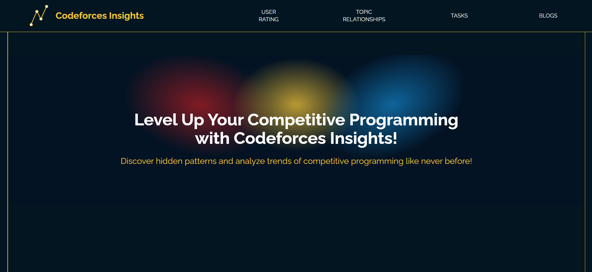
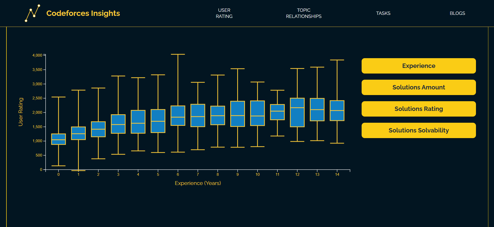
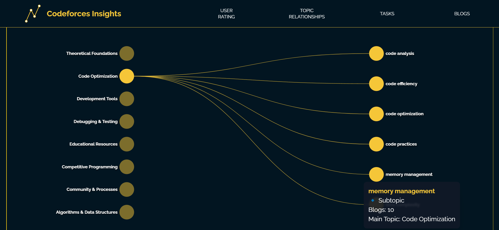

<a id="readme-top"></a>

[![Contributors][contributors-shield]][contributors-url]
[![Forks][forks-shield]][forks-url]
[![Issues][issues-shield]][issues-url]


<br />
<div align="center">
  <h3 align="center">Codeforces Insights</h3>
  <p align="center">
    🟡 Website visualizing statistics of competitive programmers activity on the Codeforces🟡
    <br />
  </p>
</div>


<details>
  <summary>Table of Contents</summary>
  <ol>
    <li>
      <a href="#about-the-project">About The Project</a>
    </li>
    <li>
      <a href="#roadmap">Roadmap</a>
    </li>
    <li>
      <a href="#website-appearance">Website appearance</a>
    </li>
    <li>
      <a href="#project-structure">Project structure</a>
    </li>
    <li><a href="#built-with">Built With</a></li>
    <li><a href="#launch-the-project">Launch the project</a></li>
    <ul>
        <li><a href="#backend">Backend</a></li>
        <li><a href="#frontend">Frontend</a></li>
      </ul>
    </li>
  </ol>
</details>

## About The Project
We aim to create a website that will reflect the dependence of the development of competitive programming skills on various learning factors. Our project will be based on data from the Codeforces website. This website contains tasks and regularly holds contests, through which participants change their rating. 

 The goal of the project </span> is to guide developing competitive programmers in the right direction by demonstrating what topics were studied and what tasks were solved by individuals who reached their desired rating.

<p align="right">(<a href="#readme-top">back to top</a>)</p>

## Website appearance

<p align="center">
  
  <br>
  <em>Main screen</em>
</p>

<p align="center">
  
  <br>
  <em>Graph of user rating dependence on registration date</em>
</p>

<p align="center">
  
  <br>
  <em>Main topics of codeforce blogs and their subtopics</em>
</p>

<p align="right">(<a href="#readme-top">back to top</a>)</p>

## Roadmap

**Week 1:** Design generation  
**Week 2:** Scraping data, data preprocessing, filling the database  
**Week 3:** Visualization planning, Flask API development  
**Week 4:** LLM creation or choice  
**Week 5:** Frontend implementation  
**Week 6:** Implementation of core visualizations in D3.js and basic chart integrations  
**Week 7:** Implementation of interactive features, panel integration, advanced feature development  
**Week 8:** Final testing, polishing, presentation preparation

<p align="right">(<a href="#readme-top">back to top</a>)</p>

## Project Structure

```plaintext
CF-INSIGHTS-LAST/
├── backend/                     # Backend application (FastAPI)
│   ├── app.py                   # Main application entry point
│   ├── config.py                # Project configuration settings
│   ├── models.py                # Data models definitions
│   ├── routes.py                # API routes definitions
│   ├── swagger.yml              # API documentation (Swagger format)
│   ├── requirements.txt         # Python dependencies list
│   ├── .env                     # Environment variables for backend
│   └── exploratory_data_analysis/ # Data analysis and research scripts
│
├── frontend/                    # Frontend application (React + Tailwind CSS)
│   ├── public/                  # Static assets
│   ├── src/                     # Frontend source code
│   ├── package.json             # Frontend dependencies and scripts
│   ├── tailwind.config.js       # Tailwind CSS configuration
│   ├── postcss.config.js        # PostCSS configuration
│   └── .env                     # Environment variables for frontend
│
├── README.md                    # Project documentation
└── .gitignore                   # List of files and folders ignored by Git
```

<p align="right">(<a href="#readme-top">back to top</a>)</p>

## Built With

The Daily Meeting Telegram was built using:

* [![Python][Python.js]][Python-url]
  * [![Flask][Flask.js]][Flask-url]
  * [![SQLAlchemy][SQLAlchemy.js]][SQLAlchemy-url]
* [![PostgreSQL][PostgreSQL.js]][PostgreSQL-url]
* [![React][React.js]][React-url]

<p align="right">(<a href="#readme-top">back to top</a>)</p>


## Launch the project

### Backend

Go to the `backend` folder and create a virtual environment:

```bash
cd backend
python -m venv venv        # Create a virtual environment
source venv/bin/activate   # For Linux/macOS
venv\Scripts\activate      # For Windows
pip install -r requirements.txt  # Install dependencies
```

Create a `.env` file in the `backend` folder and populate it with the following environment variables:

   ```ini
   DB_NAME=your_database_name
   DB_USER=your_database_user
   DB_PASSWORD=your_database_password
   DB_HOST=your_database_host
   DB_PORT=your_database_port
   ```

Run the Flask server

```bash
python app.py
```
After the server starts, it will be available at http://127.0.0.1:8000.

API documentation will be available at [http://127.0.0.1:8000/api/ui](http://127.0.0.1:8000/api/ui)

<p align="right">(<a href="#readme-top">back to top</a>)</p>

### Frontend
Go to the frontend folder and install dependencies:

```bash
cd ../frontend
npm install
```

To run both parts of the project (frontend + backend) simultaneously, use the following command:

```bash
npm start
```

<p align="right">(<a href="#readme-top">back to top</a>)</p>


[contributors-shield]: https://img.shields.io/github/contributors/Data-Wrangling-and-Visualisation/Codeforces-Insights?style=for-the-badge&color=%23F5C638
[contributors-url]: ../../contributors

[forks-shield]: https://img.shields.io/github/forks/Data-Wrangling-and-Visualisation/Codeforces-Insights?style=for-the-badge&color=%23F5C638
[forks-url]: ../../forks

[issues-shield]: https://img.shields.io/github/issues/Data-Wrangling-and-Visualisation/Codeforces-Insights?style=for-the-badge&color=%23F5C638
[issues-url]: ../../issues

[license-shield]: https://img.shields.io/github/license/team-work-tools/team-work-telegram-bot?style=for-the-badge&color=%23F5C638
[license-url]: ./LICENSE

[Bot]: https://img.shields.io/badge/BOT-544987?style=for-the-badge
[Bot-url]: https://t.me/daily_meeting_t34_bot

[Python.js]: https://img.shields.io/badge/Python-F5C638?style=for-the-badge&logo=python&logoColor=grey
[Python-url]: https://www.python.org/

[Flask.js]: https://img.shields.io/badge/Flask-AB8000?style=for-the-badge&logo=flask&logoColor=white
[Flask-url]: https://flask.palletsprojects.com/en/stable/

[SQLAlchemy.js]: https://img.shields.io/badge/SQLalchemy-AB8000?style=for-the-badge&logo=SQLalchemy&logoColor=white
[SQLAlchemy-url]: https://www.sqlalchemy.org/

[PostgreSQL.js]: https://img.shields.io/badge/PostgreSQL-F5C638?style=for-the-badge&logo=PostgreSQL&logoColor=grey
[PostgreSQL-url]: https://www.postgresql.org/

[React.js]: https://img.shields.io/badge/React-F5C638?style=for-the-badge&logo=React&logoColor=grey
[React-url]: https://react.dev/
